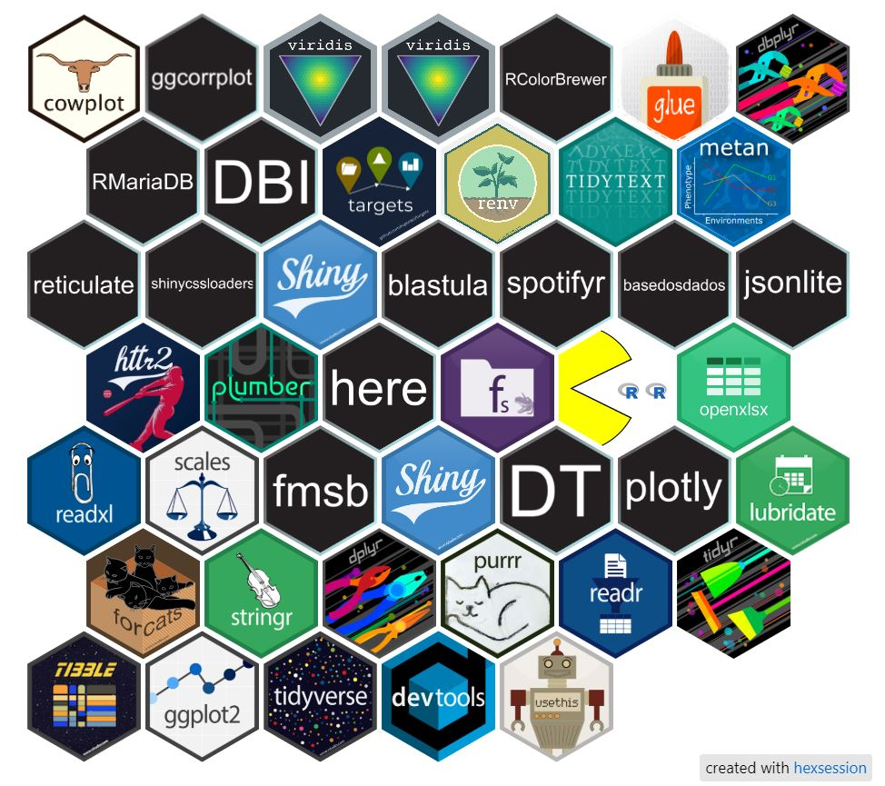

# Pacotes essenciais no R

### Obs: Esses foram alguns dos pacotes utilizados no Curso de: Introdução à Programação com R para Ciência de Dados

<br>

[](https://comunidade-estatistica.quarto.pub/ementas/) [](https://comunidadedeestatistica.com.br/#sobre)

<br>

Trabalhamos cada um deles porque representam exatamente o que um Analista, Cientista de dados ou Pesquisador enfrenta no dia a dia.

-   O tidyverse, por exemplo, mostra como é possível manipular, transformar e visualizar dados com fluidez, permitindo que a análise realmente aconteça sem ruído.

-   E, conforme avançamos, entramos em ferramentas que ampliam o alcance do R: consumo de APIs com httr2, criação de serviços com plumber, automação com blastula, integração com Python via reticulate, construção de dashboards com shiny e organização de pipelines reprodutíveis com targets.

-   Para quem vive o contexto de pesquisa, exploramos metan, dbplyr, RMariaDB e outras peças importantes para análises experimentais e banco de dados.

    > Minha intenção foi mostrar como esses pacotes ajudam a resolver problemas reais, facilitando desde o primeiro contato com os dados até a entrega final de resultados.
    >
    > No fim, o que quero que fique é a visão de que dominar esse conjunto não é só saber usar funções, mas conseguir montar um fluxo de trabalho sólido, claro e aplicável em qualquer ambiente de análise.

**`Ótimos estudos!`**

<br>

{width="677"}

<br>

| **Pacote** | **Descrição** | **Principais funções** | **Link oficial** | **Uso no curso** |
|---------------|---------------|---------------|---------------|---------------|
| hexsession | criar a imagem, HTML dos pacotes | hexsession::make_tile() | <https://hexsession.liomys.mx/index.html> | ✔️ |
| tidyverse | Coleção integrada de pacotes para manipulação e visualização de dados (`dplyr`, `ggplot2`, `readr`, etc.). | `library(tidyverse)`, `mutate()`, `filter()` | <https://www.tidyverse.org/> | ✔️ |
| dplyr | Manipulação de dados com verbos (`filter`, `mutate`, `summarise`, etc.). | `filter()`, `select()`, `arrange()` | <https://dplyr.tidyverse.org/> | ✔️ |
| tidyr | Estruturação de dados em formato *tidy* (colunas = variáveis). | `pivot_longer()`, `pivot_wider()` | <https://tidyr.tidyverse.org/> | ✔️ |
| ggplot2 | Sistema de gráficos baseado na *Grammar of Graphics*. | `ggplot()`, `geom_point()`, `facet_wrap()` | <https://ggplot2.tidyverse.org/> | ✔️ |
| plotly | Interatividade para gráficos do ggplot2 e dashboards web. | `plot_ly()`, `ggplotly()` | <https://plotly.com/r/> | ✔️ |
| DT | Tabelas interativas e dinâmicas. | `datatable()` | <https://rstudio.github.io/DT/> | ✔️ |
| bslib | Personalização visual (Bootstrap 5) para Shiny e Quarto. | `bs_theme()`, `bs_add_variables()` | <https://rstudio.github.io/bslib/> | ✔️ |
| fmsb | Gráficos radar e análises multivariadas. | `radarchart()` | <https://cran.r-project.org/package=fmsb> | ✔️ |
| scales | Formatação e padronização de eixos e legendas. | `label_percent()`, `label_number()` | <https://scales.r-lib.org/> | ✔️ |
| forcats | Manipulação de fatores (variáveis categóricas). | `fct_reorder()`, `fct_lump()` | <https://forcats.tidyverse.org/> | ✔️ |
| stringr | Manipulação de textos e padrões (regex). | `str_detect()`, `str_replace()` | <https://stringr.tidyverse.org/> | ✔️ |
| readr | Leitura eficiente de arquivos CSV e TXT. | `read_csv()`, `read_delim()` | <https://readr.tidyverse.org/> | ✔️ |
| readxl | Importação de planilhas Excel. | `read_excel()` | <https://readxl.tidyverse.org/> | ✔️ |
| openxlsx | Exportação e leitura de planilhas Excel com formatação. | `write.xlsx()` | <https://cran.r-project.org/package=openxlsx> | ✔️ |
| pacman | Instala e carrega múltiplos pacotes de forma automática. | `p_load()` | <https://cran.r-project.org/package=pacman> | ✔️ |
| fs | Manipulação de diretórios e arquivos. | `dir_create()`, `file_copy()` | <https://fs.r-lib.org/> | ✔️ |
| here | Caminhos relativos reprodutíveis. | `here("dados","input.csv")` | <https://here.r-lib.org/> | ✔️ |
| plumber | Criação de APIs RESTful em R. | `pr()`, `pr_run()` | <https://www.rplumber.io/> | ✔️ |
| httr2 | Consumo moderno de APIs REST com autenticação. | `request()`, `req_perform()` | <https://httr2.r-lib.org/> | ✔️ |
| jsonlite | Conversão entre R e JSON. | `fromJSON()`, `toJSON()` | <https://cran.r-project.org/package=jsonlite> | ✔️ |
| basedosdados | Acesso a bases públicas via BigQuery. | `bdplyr()`, `bd_collect()` | <https://basedosdados.org/> | ✔️ |
| spotifyr | Consumo da API do Spotify. | `get_artist_audio_features()` | <https://cran.r-project.org/package=spotifyr> | ✔️ |
| blastula | Automação de envio de e-mails HTML. | `compose_email()`, `smtp_send()` | <https://blastula.rstudio.com/> | ✔️ |
| shiny | Criação de dashboards e aplicações interativas. | `fluidPage()`, `renderPlot()` | <https://shiny.posit.co/> | ✔️ |
| shinycssloaders | Adiciona ícones de carregamento no Shiny. | `withSpinner()` | <https://cran.r-project.org/package=shinycssloaders> | ✔️ |
| reticulate | Integração entre R e Python. | `import()`, `py_run_string()` | <https://rstudio.github.io/reticulate/> | ✔️ |
| metan | Análises experimentais e genéticas (BLUP, MGIDI, etc.). | `gamem()`, `mgidi()`, `blup()` | <https://tiagoolivoto.github.io/metan/> | ✔️ |
| tidytext | Processamento de linguagem natural. | `unnest_tokens()`, `bind_tf_idf()` | <https://juliasilge.github.io/tidytext/> | ✔️ |
| renv | Controle de versões de pacotes e ambientes. | `renv::init()`, `renv::snapshot()` | <https://rstudio.github.io/renv/> | ✔️ |
| targets | Pipelines reprodutíveis de análise. | `tar_target()`, `tar_make()` | <https://books.ropensci.org/targets/> | ✔️ |
| DBI | Interface de banco de dados. | `dbConnect()`, `dbReadTable()` | <https://cran.r-project.org/package=DBI> | ✔️ |
| RMariaDB | Conector específico para MariaDB/MySQL. | `dbConnect(MariaDB())` | <https://cran.r-project.org/package=RMariaDB> | ✔️ |
| dbplyr | Tradução dplyr → SQL para bancos de dados. | `tbl(con, "tabela")` | <https://dbplyr.tidyverse.org/> | ✔️ |
| glue | Interpolação de variáveis em strings. | `glue("Valor: {x}")` | <https://glue.tidyverse.org/> | ✔️ |
| RColorBrewer | Paletas de cores para gráficos. | `brewer.pal()` | <https://cran.r-project.org/package=RColorBrewer> | ✔️ |
| viridis | Paletas acessíveis e perceptualmente uniformes. | `scale_color_viridis_d()` | <https://cran.r-project.org/package=viridis> | ✔️ |
| ggcorrplot | Visualização elegante de correlação. | `ggcorrplot()` | <https://cran.r-project.org/package=ggcorrplot> | ✔️ |
| cowplot | Combina múltiplos gráficos em um layout. | `plot_grid()` | <https://cran.r-project.org/package=cowplot> | ✔️ |

<br>

### Como reproduzir a estrutura mostrada na imagem

A imagem acima mostra a estrutura de arquivos usada neste repositório.\
Para reproduzir a mesma organização no seu ambiente, crie uma pasta com a seguinte árvore:

``` text
.
├── .gitattributes
├── pacotes_essenciais.R
├── pacotes_essenciais.qmd
├── README.md
├── README.html
├── pacotes.JPG
└── temp_hexsession/
    └── ...
```

**Passo a passo**

1.  Crie uma pasta para o projeto no seu computador.
2.  Dentro dela, salve:

-   pacotes_essenciais.R

-   pacotes_essenciais.qmd

-   README.md

3.  Renderize o arquivo Quarto (pacotes_essenciais.qmd) para HTML para gerar o arquivo README.html, se desejar manter a visualização em HTML.

    -   Os pacotes que você quer visualizar na imagem devem ser carregados com a função **`library()`**.

4.  No R, execute:

``` text
    library(hexsession)

    hexsession::make_tile()
```

-   Isso cria a pasta temp_hexsession/, responsável pela sessão usada na geração da imagem.

-   Abrindo essa pasta no seu gerenciador de arquivos ou no RStudio, você verá uma estrutura igual à da imagem que acompanha o projeto.
